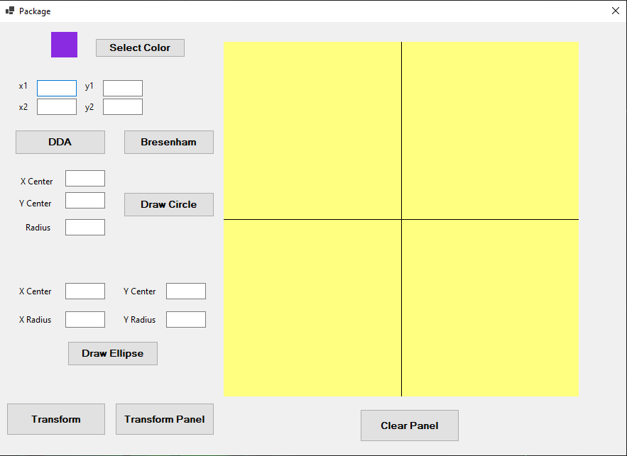
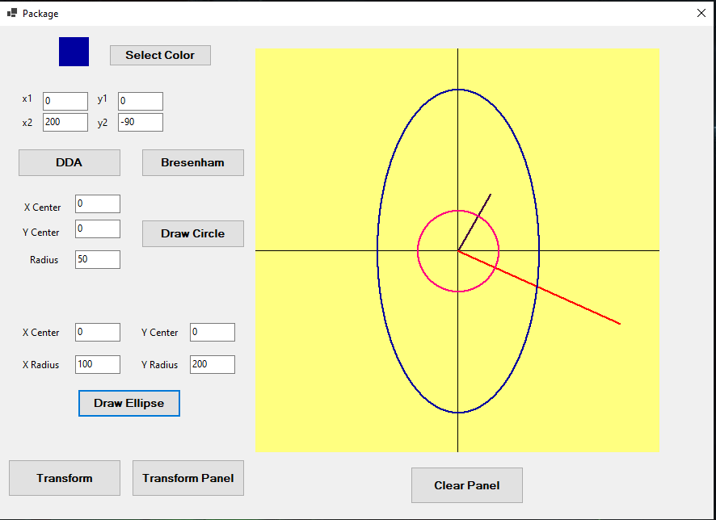
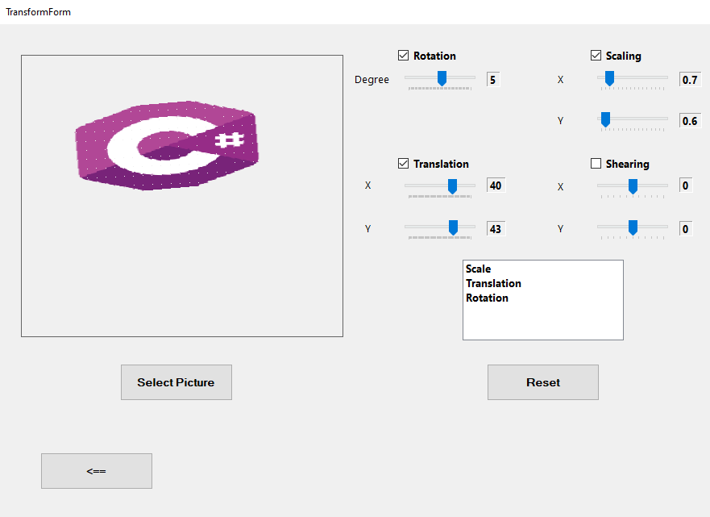
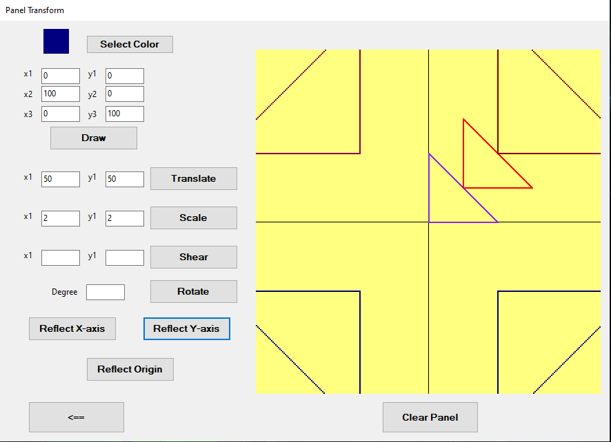

# Graphics Transformation Tool

## Description

This is a C# Windows Forms application for performing various 2D transformations on graphics, including:

- **Translation**
- **Rotation**
- **Scaling**
- **Shearing**
- **Reflection**

The project provides an interactive UI for transforming both drawn shapes and images.

## Screenshots

## Features

- **Draw and Transform Shapes**: Supports DDA and Bresenham algorithms for line drawing, as well as midpoint algorithms for circles and ellipses.
- **Apply Transformations**: Users can apply transformations using UI controls such as sliders and text inputs.
- **Real-Time Updates**: Changes are reflected immediately on the panel.
- **Image Transformations**: Load an image and apply transformations.

## Installation

1. Clone the repository or download the project files.
2. Open the solution in **Visual Studio**.
3. Build and run the project.

## Usage

1. Use `DrawForm` to create and transform shapes.
2. Use `TransformForm` to load and manipulate images.
3. Apply transformations using buttons and sliders.
4. Click **Reset** to restore the original image or shape.

## Project Structure

- `DrawForm.cs`: Handles drawing and shape transformations.
- `TransformForm.cs`: Manages image transformations.
- `PanelTransform.cs`: Manages transformations on a separate panel.
- `PanelTransformation.cs`: Implements transformation logic using matrix operations.
- `Transform.cs`: Defines image transformation functions.
- `Program.cs`: Entry point of the application.

## Dependencies

- .NET Framework
- Windows Forms (System.Windows.Forms)
